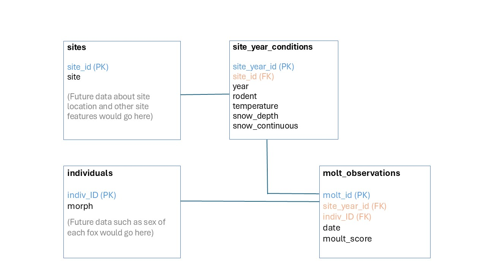

# Creating a Relational Database

## Structure of the relational database

I created a relational database, as outlined in the following ERD:

```{r ERD, echo = FALSE, eval = TRUE, fig.cap="", fig.align='center', out.width='150%'}

```

A parent table of sites assigns a short (3 characters) site ID to each site name (which are long Norwegian names with special characters). Another parent table lists each individual fox and its color morph (white or blue), which does not change. An intermediate table contains the environmental conditions at each site each year, and the final table contains all the molt observations of individual foxes. For these last two tables, the site_year_id and molt_id primary keys are autogenerated integers.

## Creating the empty database

The relational database was constructed as follows. First, load the necessary R packages:

```{r load_packages, echo = TRUE, eval = TRUE}
# Load packages

library(DBI)
library(RSQLite)
```

Then, establish a database connection to create the database (note that this will be stored in whatever directory you are working in):

```{r db_setup, echo = TRUE, eval = FALSE}
# Create database

ArcticFox_db <- dbConnect(RSQLite::SQLite(), "ArcticFox_db.db")
```

Next, we can construct each table in the database using the RSQLite package. Here is the code to create the sites table, with columns for site id and the original site name:

```{r sites_structure, echo = TRUE, eval = FALSE}
# Create sites table
dbExecute(ArcticFox_db,
         "CREATE TABLE sites (
            site_id char(3) NOT NULL PRIMARY KEY,
            site varchar(40)
          );")
```

Code for the individuals table, which contains columns for individual ID and the morph (which does not change for each individual). Because there are only two possible entries for color morph, I constrained the characters using `CHECK` in the table.:

```{r individuals_structure, echo = TRUE, eval = FALSE}
# Create individuals table
dbExecute(ArcticFox_db, 
          "CREATE TABLE individuals (
indiv_ID varchar(12) NOT NULL PRIMARY KEY,
morph char(1) CHECK (morph IN ('W', 'B'))
);")
```

The site_year_conditions table will contain columns for the site id, year, and the environmental conditions (rodent index, temperature, snow depth, snow continuity). Note that because there are only four possible values for the rodent index, I constrained the values using `CHECK` in the table. It will also auto generate an integer for the site-year ID, which is the primary key:

```{r siteyear_structure, echo = TRUE, eval = FALSE}
# Create site-year conditions table
dbExecute(ArcticFox_db,
          "CREATE TABLE site_year_conditions (
site_year_id integer PRIMARY KEY AUTOINCREMENT,
site_id char(3),
year integer,
rodent integer CHECK (rodent IN ('1', '2', '3', '4')),
temperature real,
snow_depth real,
snow_continuous integer,
FOREIGN KEY (site_id) REFERENCES sites(site_id)
);")
```

And finally, the molt observation table, which contains columns for site-year ID, individual ID, the date, and the molt score. It will also generate an integer for the molt ID. Note that in the original data, date is recorded as the number of days since January 1, so I set it here to an integer. The molt score is the percentage of winter coat remaining (0, 5, 25, 50, 75, 95), so it will also be set as an integer. Here is the code:

```{r motl_structure, echo = TRUE, eval = FALSE}
# Create molt observations table
dbExecute(ArcticFox_db,
          "CREATE TABLE molt_observations (
molt_id integer PRIMARY KEY AUTOINCREMENT,
site_year_id integer,
indiv_ID varchar(12),
date integer,
moult_score integer,
FOREIGN KEY (site_year_id) REFERENCES site_year_conditions(site_year_id),
FOREIGN KEY (indiv_ID) REFERENCES individuals(indiv_ID)
);")
```
