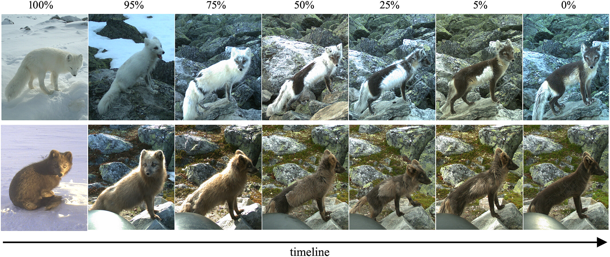
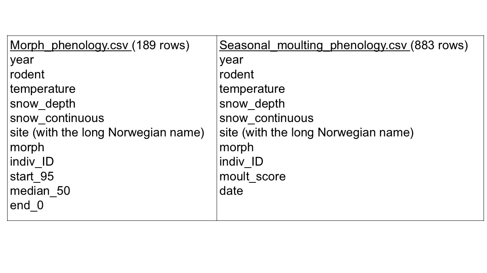

# Introduction

The Arctic fox (*Vulpes lagopus*), like many species who live with seasonal snow, undergo a molt from denser fur in the winter to a shorter coat in the summer. Additionally, Arctic foxes occur in two color morphs, white and blue. During the molt, the white color morph changes from fully white in the winter to dorsally brownish in the summer, while the blue color morph varies from slightly lighter in winter to darker brown-gray in summer. Examples of these color morphs and seasonal pelage are shown in Fig. 1.1, taken from Laporte-Devylder et al, 2022.

```{r, echo = FALSE, eval = TRUE, fig.cap="Arctic foxes of the white (top) and blue (bottom) color morphs, from winter (100%) to summer (0%) coats.", fig.align='center', out.width='100%'}

```

## Overview of project

I based my project on a study that looked at the timing and rate of seasonal molting of Arctic foxes (Laporte-Devylder et al, 2022). The dataset for this study consists of camera trap observations of Arctic foxes across 22 sites in Norway during their molting season, from 2011-2018. The dataset also includes average seasonal temperature each year (averaged across all sites) and site-specific measures of snow depth, snow continuity (number of days with snow on the ground) and a rodent density index for each site for each year sampled. (Not all sites were sampled each year.) The authors were interested in examining the timing of the molt in relation to environmental condtions.

I downloaded two csv files from this Arctic fox dataset. Both tables contain too many categories of information and a lot of duplicated information, so my project was to clean up the data and reorganize them into a relational database. I also created a few visualizations of some of the data to begin to explore general trends in the data.

## Format of original data

The first original table (morph_phenology.csv) lists individual foxes and their color morph with the site, year, several measurements of environmental conditions at that site and year, and columns summarizing the start, median, and ending dates of the molt for that individual that year. This means that every individual fox observation also lists again all the measured environmental conditions for the corresponding site and year – that’s a lot of duplication! Similarly, the second original table (seasonal_moulting_phenology.csv) contains all those same data again, but with additional rows for each individual, listing all molt observations and dates for that individual, rather than a summary of the start-median-end of the molt. And again, all the site-year conditions are relisted with every entry (in addition to the molt data being duplicated). These highly duplicated data are just screaming to be reorganized into a relational database.

For reference, here is a list of the columns contained in the two original csv files:

```{r csv_chart, echo = FALSE, eval = TRUE, fig.cap="", fig.align='center', out.width='80%'}

```

**Data obtained from:**

Laporte-Devylder, Lucie et al. (2022). Data from: A camera trap based assessment of climate-driven phenotypic plasticity of seasonal moulting in an endangered carnivore [Dataset]. Dryad. <https://doi.org/10.5061/dryad.xd2547dhm>